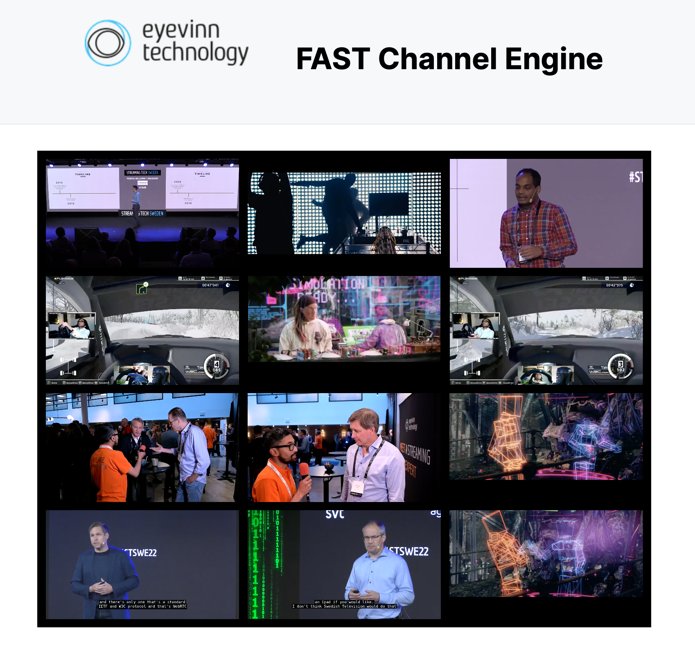
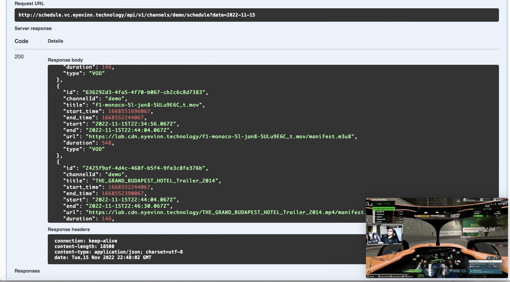

# FAST by Eyevinn Technology

The Sustainable FAST Channel Engine

---



Based on VOD2Live Technology and the [open source Eyevinn Channel Engine library](https://vod2live.docs.eyevinn.technology) you can generate a numerous amounts of FAST channels with a fraction of energy consumption compared to live transcoded FAST channels.

## Quick Start

### Demo Installation

Start an instance with 50 demo channels.

```
docker run -d -p 8000:8000 -p 8001:8001 \
  -e DEMO_NUM_CHANNELS=50 \
  eyevinntechnology/fast-engine
```

Open the URL [http://localhost:8001/](http://localhost:8001/) in your browser for a multiview of all 50 channels, and to playback one of the 50 channels point your HLS video player to the URL: `http://localhost:8000/channels/<N>/master.m3u8` where `<N>` is a number between 1 and 50.

### Channel from a Playlist TXT File

To produce a channel based on a txt file with a list of VOD URLs:

```bash
docker run -d -p 8000:8000 \
  -e FAST_PLUGIN=Playlist \
  -e PLAYLIST_URL=https://testcontent.eyevinn.technology/fast/fast-playlist.txt \
  eyevinntechnology/fast-engine
```

A channel based on this playlist is then available at `http://localhost:8000/channels/playlist/master.m3u8`.

### Schedule Service and FAST Engine

To spin up a Schedule Service and FAST Channel Engine.

```bash
curl -SL https://github.com/Eyevinn/docker-fast/releases/download/v1.1.1/docker-compose.yml | docker-compose -f - up
```

Running this command above it will spin up three Docker containers:

- A local Dynamo DB instance that the Schedule Service uses.
- A Schedule Service instance.
- A Channel Engine instance.

For demo and POC you can use a local Dynamo DB instance but it is recommended to use an AWS Dynamo DB resource.

A demo channel called `eyevinn` is created by default. To get the schedule for a specific date `YYYY-MM-DD`.

```bash
curl -X 'GET' \
  'http://localhost:8080/api/v1/channels/eyevinn/schedule?date=YYYY-MM-DD' \
  -H 'accept: application/json'
```



And to play the channel direct your HLS video player to the URL [http://localhost:8000/channels/eyevinn/master.m3u8](http://web.player.eyevinn.technology/?manifest=http%3A%2F%2Flocalhost%3A8000%2Fchannels%2Feyevinn%2Fmaster.m3u8)

You might need to wait a few minutes first for the channel to be ready. Documentation on how to manage schedules and channels are found in [this section](plugins/schedule_service.md).

## Installation

To startup an engine that connects to an online Demo instance of the Eyevinn Schedule Service.

```
docker run -d -p 8000:8000 \
  -e FAST_PLUGIN=ScheduleService \
  eyevinntechnology/fast-engine
```

Connect with your own instance of the Eyevinn Schedule Service.

```
docker run -d -p 8000:8000 \
  -e FAST_PLUGIN=ScheduleService \
  -e SCHEDULE_SERVICE_API_URL=<your-schedule-service-api-url> \
  eyevinntechnology/fast-engine
```

### Options

The following environment variables can be set:

- `PORT`: Which port to bind the service to.
- `UI_PORT`: Which port to bind the UI to.
- `FAST_PLUGIN`: Which [plugin](plugins.md) to use.
- `OPTS_USE_DEMUXED_AUDIO`: Use demuxed audio (default: true).
- `OPTS_USE_VTT_SUBTITLES`: Use VTT subtitles whenever available (default: true).
- `OPTS_DEFAULT_SLATE_URI`: URI to default slate URL.
- `OPTS_HEARTBEAT_URL`: Heartbeat url (default: `/`).
- `OPTS_STREAM_ORDER`: Stream order as comma separated list of heights (default: `"458,1080,720,286,214"`)
- `OPTS_VIDEO_STREAMS`: Override video profile using a comma separated list of resolution and bandwidth tupels. For example: `-e OPTS_VIDEO_STREAMS="416x234:324586,640x360:471661"`
- `OPTS_LANG_LIST`: Comma separated list of languages, e.g. (`"en,ja"`). First one is defined to be default
- `OPTS_LANG_LIST_SUBS`: Comma separated list of subtitle languages, e.g. (`"en,ja"`). First one is defined to be default
- `OPTS_CHANNEL_PRESET`: Channel profile based on presets:
  - `DD`: Sterao (2) and Dolby Digital (6)
  - `ATMOS`: Stereo (2) and Dolby Atmos track (16)

### Advanced Audio

Example of Sol Levante in Dolby Atmos audio:

```
docker run -p 8000:8000 \
  -e FAST_PLUGIN=Loop \
  -e LOOP_VOD_URL=https://testcontent.eyevinn.technology/dolby/index.m3u8 \
  -e OPTS_CHANNEL_PRESET=ATMOS \
  -e OPTS_LANG_LIST=ja,en \
  eyevinntechnology/fast-engine
```

### Multiview

A multiview is available on port 8001 unless overriden by the environment variable `UI_PORT`. To enable it you need to expose the port 8001 when starting the container, e.g.

```
docker run -d -p 8000:8000 -p 8001:8001 \
  -e FAST_PLUGIN=ScheduleService \
  -e SCHEDULE_SERVICE_API_URL=<your-schedule-service-api-url> \
  eyevinntechnology/fast-engine
```

## Support

Join our [community on Slack](http://slack.streamingtech.se) where you can post any questions regarding any of our open source projects. Eyevinn's consulting business can also offer you:

- Further development of this component
- Customization and integration of this component into your platform
- Support and maintenance agreement

Contact [sales@eyevinn.se](mailto:sales@eyevinn.se) if you are interested.

## About Eyevinn Technology

[Eyevinn Technology](https://www.eyevinntechnology.se) is an independent consultant firm specialized in video and streaming. Independent in a way that we are not commercially tied to any platform or technology vendor. As our way to innovate and push the industry forward we develop proof-of-concepts and tools. The things we learn and the code we write we share with the industry in [blogs](https://dev.to/video) and by open sourcing the code we have written.

Want to know more about Eyevinn and how it is to work here. Contact us at work@eyevinn.se!
