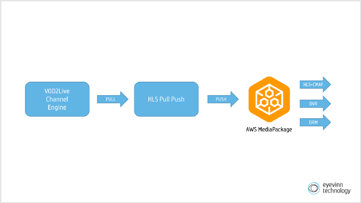
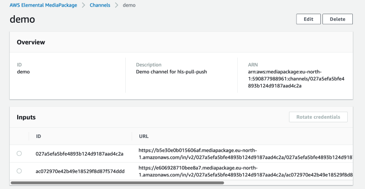
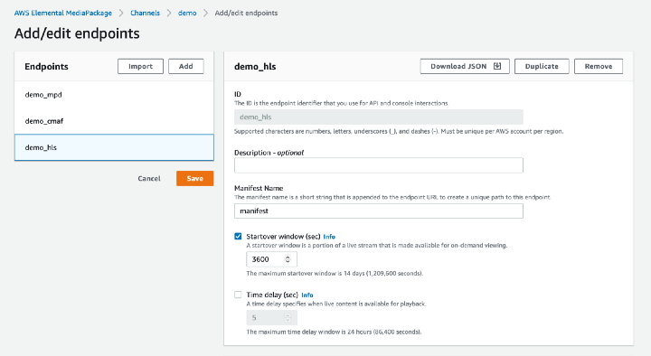
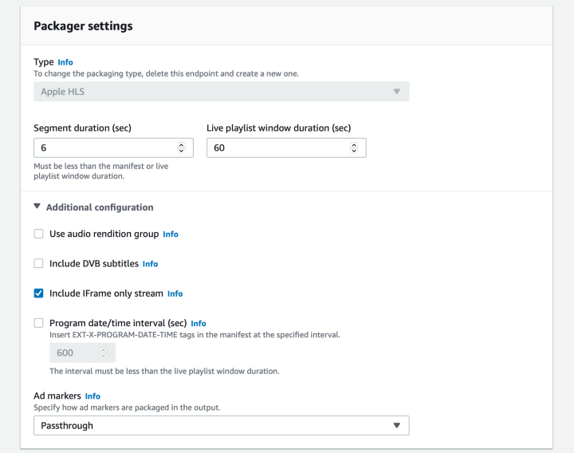
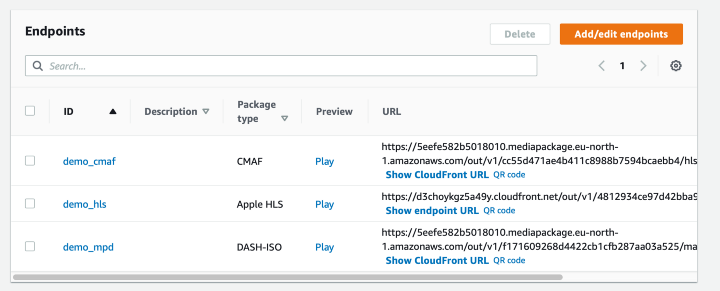

[AWS MediaPackage](https://aws.amazon.com/mediapackage/) is a just-in-time video packaging and origination service that runs in the Amazon Web Services cloud. Integrating the FAST Channel Engine enables the following use cases.

- Giving the viewer the ability to pause the VOD2Live stream and continue watching from that point in time.
- Giving the viewer the ability to start to watch the VOD2Live stream from a point in time earlier than “now” (time shifted).
- The VOD2Live stream can be encrypted and protected with DRM.
- Compatibility with the latest streaming formats such as Apple HLS with CMAF media segments.

The FAST Channel Engine is an origin service which means that a video player, either directly or through a CDN, pulls the HLS content from the engine. To get HLS content uploaded to an AWS MediaPackage you would push the HLS content to one (or both) of the ingest endpoints the AWS MediaPackage channel provides. As the FAST Channel Engine is an origin service it does not offers the functionality to push the content to another origin such as the AWS MediaPackage origin. This is intentional as the FAST Channel Engine service is designed to not only handle static channels but also session based channels. A session based channel is where a channel is created on request.



To connect these two origin services we will use the HLS Pull Push service. Another open sourced service that can fetch (pull) HLS from one source and upload (push) it to another origin. This service includes an output plugin that works with AWS MediaPackage that will be used.

```javascript
const pullPushService = new HLSPullPush();
const outputPlugin = new MediaPackageOutput();
pullPushService.registerPlugin("mediapackage", outputPlugin);
pullPushService.listen(process.env.PORT || 8080);
```

The Pull/Push service provides an API to control the “fetchers” running. You can also programmatically create and start a fetcher.

```javascript
const outputDest = outputPlugin.createOutputDestination({
  ingestUrls: [ {
    url: <MEDIAPACKAGE_INGEST_URL>,
    username: <MEDIAPACKAGE_USERNAME>,
    password: <MEDIAPACKAGE_PASSWORD>,
  }]
}, pullPushService.getLogger());
const source = new URL("https://<my-fast-channel-engine>/channels/1/master.m3u8");
const sessionId = pullPushService.startFetcher({
  name: "demo",
  url: source.href,
  destPlugin: outputDest,
  destPluginName: "mediapackage"
});
outputDest.attachSessionId(sessionId);
```
The above snippet will pull HLS from the VOD2Live channel `https://<my-fast-channel-engine>/channels/1/master.m3u8` and push to an AWS MediaPackage channel. Ingest URL and credentials are available in the AWS MediaPackage console.



Now once you have HLS pushing to AWS MediaPackage you can configure different outputs. Create an output / endpoint for HLS and specify a startover window for the DVR functionality.



You can also configure the output to include an I-frame only stream that is useful when trick playing or scrubbing. 



The endpoints are now available for playback.


