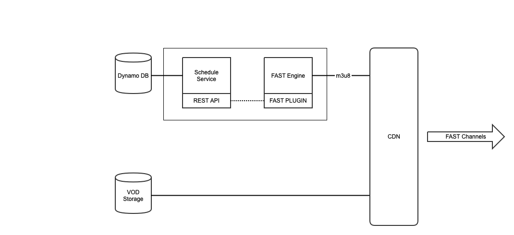

Enable the ScheduleService plugin to provide the FAST engine with channels and schedules from an Eyevinn Schedule Service.



# Creating a channel and automatically generate schedule

Follow these steps to create a new channel where the schedule is automatically populated from a simplified MRSS feed. We will be using `<SCHEDULE_API_URL>` throughout this guide and you will need to replace that with the actual API url to the Schedule Service. If you used the Quick Start docker-compose file the URL is `http://localhost:8080/api/v1`. And the `<SCHEDULE_HOST>` would be `localhost:8080`. For instructions on how to install a Schedule Service visit the [schedule service installation instructions](../schedule_service.md).

We will be using the command line tool `curl` for the HTTP requests but other HTTP API tools, for example Postman, can be used.

## Create a channel

First we will create a channel that we call `myfirstchannel`.

```
curl -X 'POST' \
  '<SCHEDULE_API_URL>/channels' \
  -H 'accept: application/json' \
  -H 'Content-Type: application/json' \
  -d '{
    "id": "myfirstchannel",
    "tenant": "<SCHEDULE_HOST>",
    "title": "My very first sustainable FAST channel"
  }'
```

You can verify that the channel is created by listing available channels.

```
curl -X 'GET' \
  '<SCHEDULE_API_URL>/channels' \
  -H 'accept: application/json'
```

## Create an auto-scheduler

Now that you have a channel created we can setup an auto-scheduler that based on a simplified MRSS feed will populate schedules for this channel. An example of this type of MRSS feed can be found here: [https://testcontent.mrss.eyevinn.technology/eyevinn.mrss](https://testcontent.mrss.eyevinn.technology/eyevinn.mrss).

```
<?xml version="1.0" encoding="utf-8"?>
<feed xmlns="http://www.w3.org/2005/Atom">
  <id>testcontent.mrss.eyevinn.technology/eyevinn.mrss</id>
  <title>Feed for Test-Content</title>
  <updated>2022-06-17T20:54:58.318Z</updated>
  <entry>
    <title>stswe19-industry-group-low-latency-hls</title>
    <id>842f1c9f-a3ec-413e-9bec-d7bb967391df</id>
    <link>https://lab.cdn.eyevinn.technology/stswe19-industry-group-low-latency-hls.mp4/manifest.m3u8</link>
  </entry>
  ...
</feed>
```

To create an auto-scheduler for our channel we then do the following.

```
curl -X 'POST' \
  '<SCHEDULE_API_URL>/mrss' \
  -H 'accept: application/json' \
  -H 'Content-Type: application/json' \
  -d '{
  "id": "myautoscheduler",
  "tenant": "<SCHEDULE_HOST>",
  "url": "https://testcontent.mrss.eyevinn.technology/eyevinn.mrss",
  "channelId": "myfirstchannel",
  "config": {
    "scheduleRetention": 3
  }
}'
```

## Get schedule for the channel

To verify that the auto-scheduler is running and populating the schedule we can list the schedule for a channel.

```
curl -X 'GET' \
  '<SCHEDULE_API_URL>/channels/myfirstchannel/schedule?date=2022-11-16' \
  -H 'accept: application/json'
```

where you would see something similar to this.

```
[
  {
    "id": "0e1e5cc7-7f86-402e-9a40-f47e76ce3be9",
    "channelId": "myfirstchannel",
    "title": "stswe19-global-but-local-ott-platform",
    "start_time": 1668614579939,
    "end_time": 1668614779939,
    "start": "2022-11-16T16:02:59.939Z",
    "end": "2022-11-16T16:06:19.939Z",
    "url": "https://lab.cdn.eyevinn.technology/stswe19-global-but-local-ott-platform.mp4/manifest.m3u8",
    "duration": 200,
    "type": "VOD"
  },
  {
    "id": "5225dd7c-2cef-4a57-8eac-fa50b027a859",
    "channelId": "myfirstchannel",
    "title": "wrc-jbi-arvija-finland-220126",
    "start_time": 1668614779939,
    "end_time": 1668615167939,
    "start": "2022-11-16T16:06:19.939Z",
    "end": "2022-11-16T16:12:47.939Z",
    "url": "https://lab.cdn.eyevinn.technology/wrc-jbi-arvija-finland-220126.mov/manifest.m3u8",
    "duration": 388,
    "type": "VOD"
  },
  ...
]
```